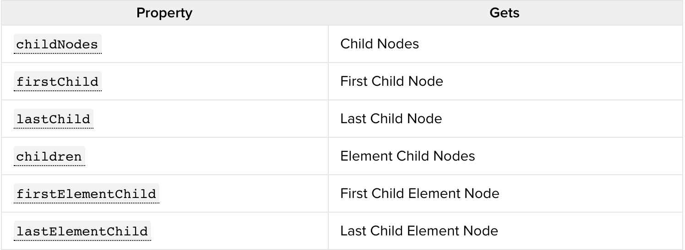

# DOM Traversing

## Check all the Root nodes
1. `document` for root DOM
2. `document.documentElement` for html
3. `document.head` for head
4. `document.title` for title
5. `document.body` for body

## Parent Nodes
The nodes in the DOM are referred to as parents, children, and siblings, depending on their relation to other nodes. The parent of any node is the node that is one level above it, or closer to the document in the DOM hierarchy. There are two properties to get the parent — parentNode and parentElement.

In index.html example:

* `html` is the parent of `head`, `body`, and `script`.
* `body` is the parent of `h1`, `h2`, `p` and `ul`, but not `li`, since `li` is two levels down from body.

## Children Nodes
The children of a node are the nodes that are one level below it. Any nodes beyond one level of nesting are usually referred to as descendants.

## Todo Tasks

1. Use firstElementChild, and change the background color of the first `li` in the `ul`.

2. Select all the `li` element and using `forEach` or `for..of` loop change the background color of all the `li` in `ul`.

3. Access `li` node using the length property i.e node[0] and access the last list and change the colot to `pink`.

4. Select the middle element `li`

5. Use the element in 4 and using sibling nodes change the background color of first and last `li` to `coral` and `aquamarine`;

6. 